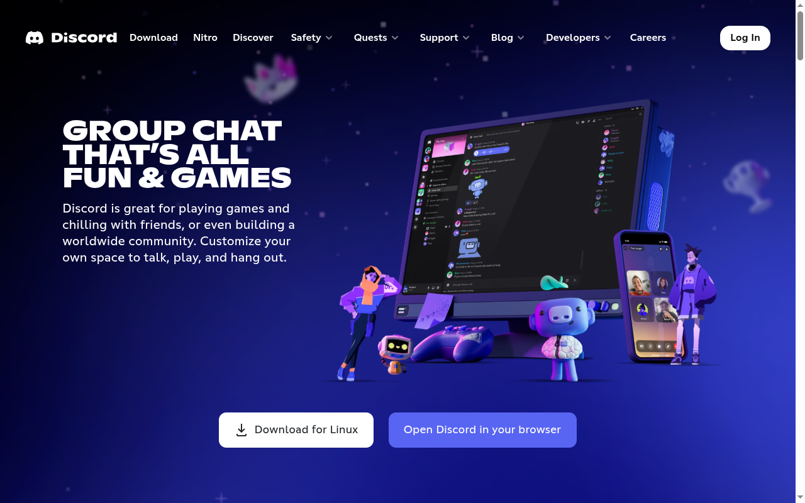
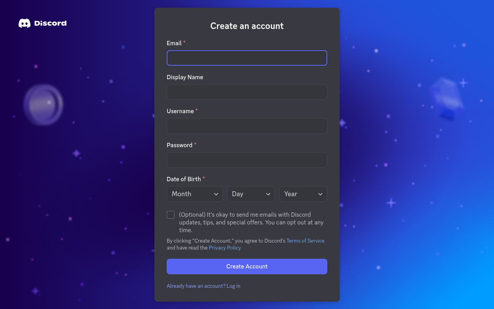
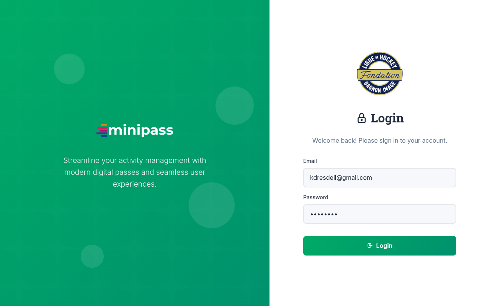
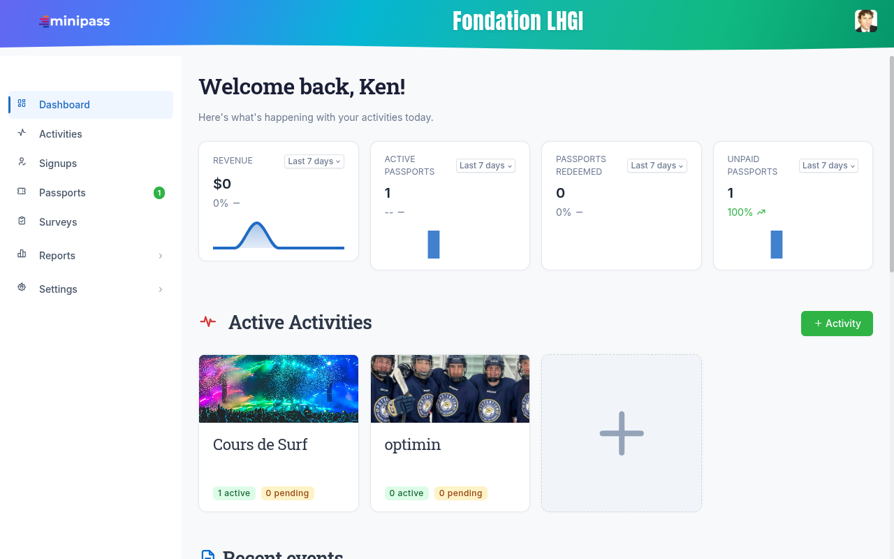
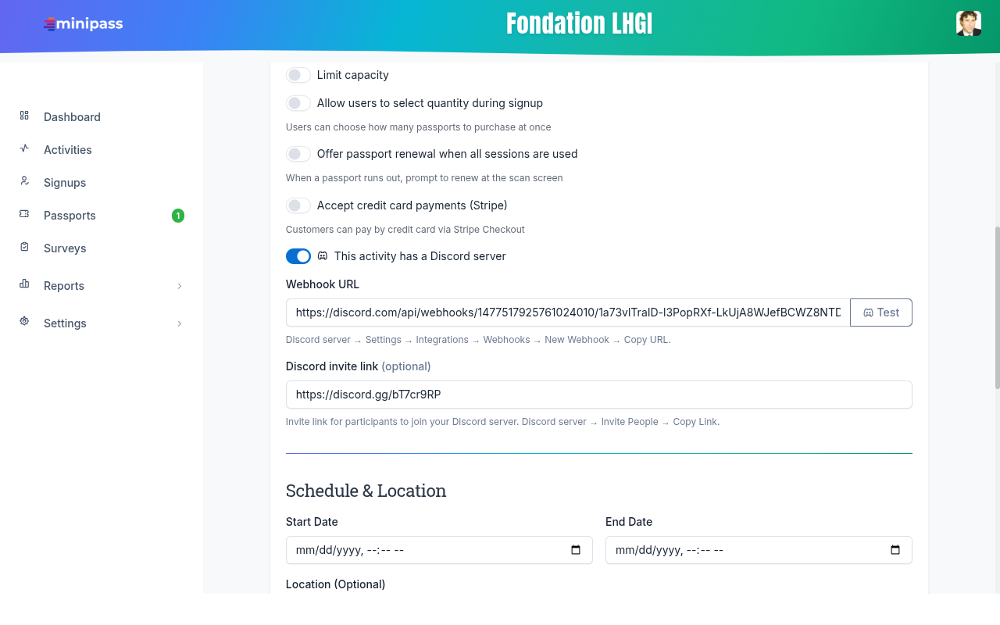
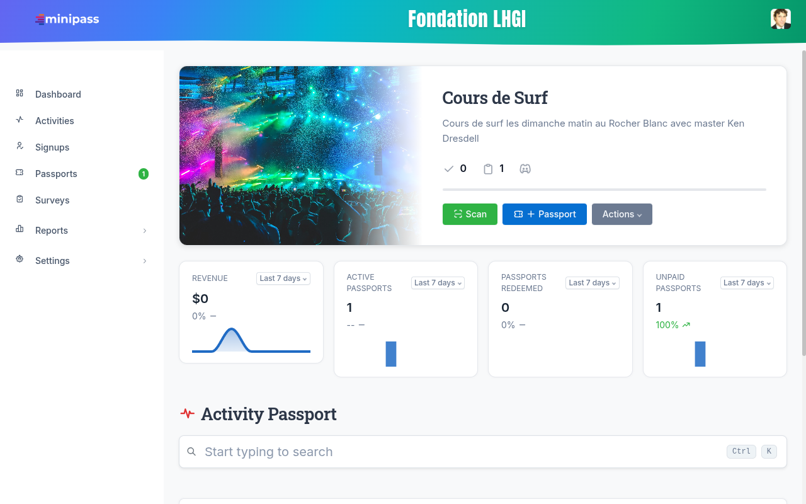
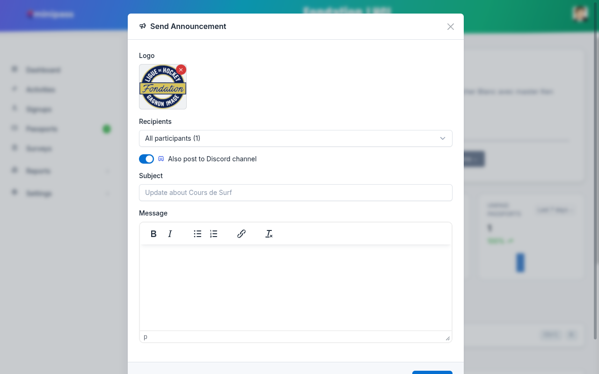

# Getting Started with Discord for Minipass Activity Managers

This guide walks you through setting up Discord for your Minipass activity — from creating a free Discord account to posting announcements directly to your community channel.

---

## What is Discord and why use it?

Discord is a free communication platform that lets you create a private community space (called a **server**) for your activity participants. Once connected to Minipass, every announcement you send will be delivered in two places simultaneously:

- **By email** — to each registered participant
- **In your Discord channel** — as a single formatted message visible to everyone in the server

This is especially useful for sports leagues, fitness classes, and recurring activities where participants want to stay connected between sessions.

---

## Step 1 — Create a Discord Account

If you don't already have a Discord account, go to [discord.com](https://discord.com) and click **Open Discord in your browser** or download the app.

You will be taken to the account creation page. Fill in your:
- **Email address**
- **Display Name** (shown to other members)
- **Username** (your unique handle)
- **Password**
- **Date of Birth**

Then click **Create Account**.

> **Tip:** Use your organization's email address so it's easy to manage. Discord accounts are free — no credit card required.

---

## Step 2 — Create a Server for Your Activity

A **server** is your private community space. Think of it like a clubhouse — you control who gets in and what channels exist inside.

1. In the left sidebar of Discord, click the **+** icon (Add a Server)
2. Choose **Create My Own**
3. Select **For a club or community** (or skip the question)
4. Give your server a name — e.g. `Hockey Fondation LHGI` or `Sunday Surf Club`
5. Click **Create**

Your server now has a default `#general` channel. You can add more channels later.

> **Best practice:** Create a dedicated `#announcements` channel and set it so only admins can post there. This keeps your announcements clean and easy to find.

---

## Step 3 — Get the Webhook URL from Discord

A **webhook** is a special URL that allows Minipass to post messages directly into your chosen channel — no bot account required.

**To create a webhook:**

1. In your Discord server, right-click the channel you want to use (e.g. `#announcements`)
2. Click **Edit Channel**
3. Go to **Integrations** → **Webhooks**
4. Click **New Webhook**
5. Give it a name (e.g. `Minipass`)
6. Click **Copy Webhook URL**

Keep this URL handy — you'll paste it into Minipass in the next step.

> **Important:** Treat your webhook URL like a password. Anyone with the URL can post to your channel. Do not share it publicly.

---

## Step 4 — Add the Webhook URL to Your Minipass Activity

Log in to your Minipass admin panel and go to **Edit Activity** for the activity you want to connect.

From your dashboard, click on the activity card or navigate to **Activities** in the sidebar.

Scroll down to the **Signup Settings** section. You will see the Discord integration toggle:

1. **Enable** the toggle labeled *"This activity has a Discord server"*
2. Paste your **Webhook URL** into the Webhook URL field
3. Optionally paste your **Discord invite link** so participants can join your server directly from their confirmation email
4. Click the **Test** button to send a test message to your channel and verify it's working
5. Click **Save**

> **Where to find your invite link:**
> In Discord → right-click your server name → **Invite People** → **Copy Link**.
> Set the invite to **Never expire** and **Unlimited uses** so you can share it once and forget about it.

---

## Step 5 — Send an Announcement to Email + Discord

Once your webhook is configured, every announcement you send from Minipass will optionally be posted to Discord at the same time.

From the **Activity Dashboard**, click **Actions** → **Send Announcement**.

In the announcement modal you will see:

- **Recipients** — choose who receives the email (All, Paid only, Unpaid only, or by passport type)
- **Also post to Discord channel** — this toggle is ON by default when a webhook is configured; turn it off if you want to send by email only
- **Subject** — the title of your message
- **Message** — your announcement body (supports bold, italic, bullet lists, and links)

Click **Send** and your message goes out to all selected participants by email AND appears in your Discord channel as a formatted embed.

---

## What Your Participants Will See on Discord

When you send an announcement, Discord displays it as a formatted embed card in your channel:

- **Title** — your announcement subject line
- **Body** — your message text (HTML formatting is converted to Discord markdown)
- **Footer** — the name of your activity

All members of your Discord server who are watching the channel will be notified instantly — no email required on their end.

---

## Best Practices

| What to do | Why |
|-----------|-----|
| Create a `#announcements` channel | Keeps activity updates separate from casual chat |
| Set `#announcements` to read-only for members | Prevents noise; only your webhook (Minipass) can post |
| Use a permanent, unlimited-use invite link | Share it once in the signup confirmation email — participants can join any time |
| Test your webhook after saving | Confirms the URL is valid before you send a real announcement |
| Keep your webhook URL private | Treat it like a password — don't paste it in public channels or emails |
| Disconnect the webhook before archiving an activity | Avoids stale webhooks accumulating in your Discord server |

---

## Troubleshooting

**My test message didn't appear in Discord**
- Verify you pasted the full webhook URL (it starts with `https://discord.com/api/webhooks/...`)
- Make sure the webhook is enabled in Discord: Channel → Edit → Integrations → Webhooks
- The webhook must point to the correct server and channel

**The Discord toggle doesn't appear in my announcement modal**
- The toggle only appears when a webhook URL is saved on the activity. Go to **Edit Activity** and add the webhook URL first.

**Participants can't join my Discord server**
- Check that the invite link has not expired. In Discord go to **Server Settings → Invites** and verify the link is still active.
- Set expiry to **Never** to avoid this issue in the future.

---

## Summary

| Step | What you do |
|------|------------|
| 1 | Create a free Discord account at discord.com |
| 2 | Create a Discord server for your activity |
| 3 | Copy the webhook URL from your channel's Integrations settings |
| 4 | Paste the webhook URL into your Minipass activity and click Test |
| 5 | Send announcements — they go to email AND Discord simultaneously |

That's it. Your community now has a real-time channel where announcements land the moment you send them from Minipass.
