# Guide de configuration Stripe pour Minipass

**Version** : 2.0 — Février 2026
**Audience** : Administrateurs d'organisations Minipass
**Support** : support@minipass.me

---

## Table des matières

1. [Prérequis](#1-prérequis)
2. [Créer un compte Stripe](#2-créer-un-compte-stripe)
3. [Obtenir votre clé secrète](#3-obtenir-votre-clé-secrète)
4. [Créer le webhook](#4-créer-le-webhook)
   - 4.1 [Aller dans la section Webhooks](#41-aller-dans-la-section-webhooks)
   - 4.2 [Sélectionner les deux événements](#42-sélectionner-les-deux-événements)
   - 4.3 [Choisir le type de destination](#43-choisir-le-type-de-destination)
   - 4.4 [Configurer l'URL de l'endpoint](#44-configurer-lurl-de-lendpoint)
   - 4.5 [Copier le Webhook Signing Secret](#45-copier-le-webhook-signing-secret)
5. [Entrer les clés dans Minipass](#5-entrer-les-clés-dans-minipass)
6. [Activer le paiement par carte sur une activité](#6-activer-le-paiement-par-carte-sur-une-activité)
7. [Résultat : ce que vos clients verront](#7-résultat--ce-que-vos-clients-verront)
8. [Vérification et test](#8-vérification-et-test)
   - 8.1 [Tester avec le mode test de Stripe](#81-tester-avec-le-mode-test-de-stripe)
   - 8.2 [Passer en mode live](#82-passer-en-mode-live)
9. [FAQ / Dépannage](#9-faq--dépannage)

---

## 1. Prérequis

Avant de commencer, assurez-vous d'avoir :

- Un compte Minipass actif avec accès **administrateur**
- Une adresse courriel valide pour créer votre compte Stripe
- Votre sous-domaine Minipass (ex : `lhgi.minipass.me`)

---

## 2. Créer un compte Stripe

**2.1** Rendez-vous sur **[https://dashboard.stripe.com/register](https://dashboard.stripe.com/register)**

Sur la page de connexion, cliquez sur **Create account** en bas du formulaire :

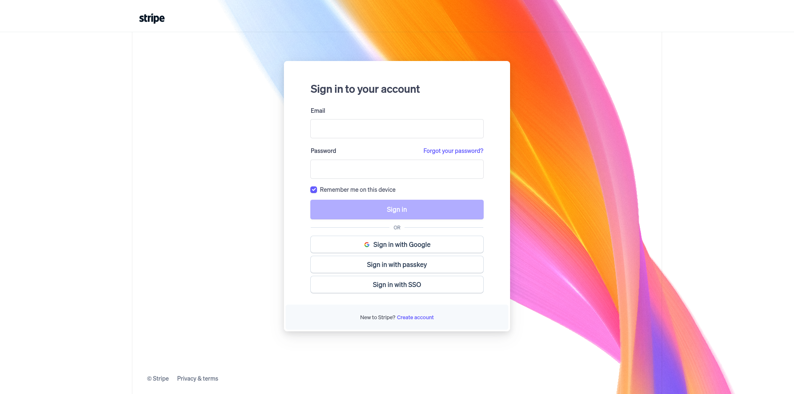

**2.2** Remplissez le formulaire d'inscription :

| Champ | Valeur |
|-------|--------|
| Email | Votre adresse courriel professionnelle |
| Full name | Votre nom complet |
| Password | Un mot de passe sécuritaire |
| Country | **Canada** |

**2.3** Cliquez sur **Create account** et vérifiez votre courriel pour activer votre compte.

> **Note — Assistant de démarrage (nouveaux comptes) :** Après la vérification de votre courriel, Stripe affiche un assistant de démarrage qui vous demande des informations sur votre organisation (type d'entreprise, coordonnées bancaires, etc.). Vous pouvez compléter cet assistant plus tard — les outils développeurs (clés API, webhooks) sont accessibles immédiatement. Pour y accéder, recherchez le lien **Developers** en bas à gauche de n'importe quelle page Stripe.

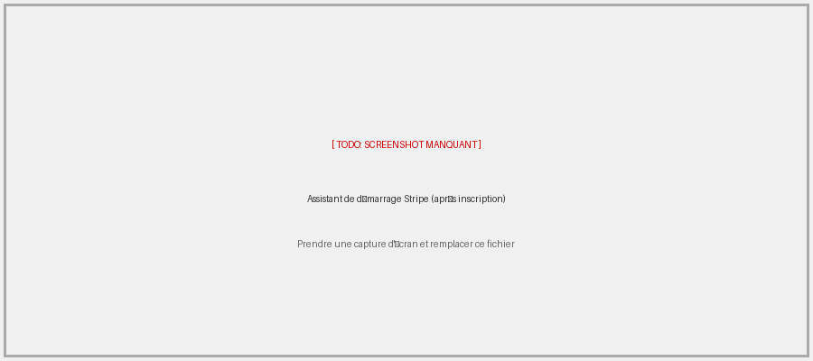

**2.4** Complétez la vérification d'identité : Stripe vous demandera des informations sur votre organisation (type d'entreprise, adresse, informations bancaires). Suivez les instructions à l'écran.

> **Note** : La vérification complète peut prendre 1 à 2 jours ouvrables. Vous pouvez configurer et tester l'intégration en **mode test** pendant ce temps.

---

## 3. Obtenir votre clé secrète

> **Note — Mode test vs mode live :** Les nouveaux comptes Stripe démarrent en **mode test** par défaut. En mode test, vos clés commencent par `sk_test_...` et vos webhooks sont isolés du mode live — c'est parfaitement normal. Ce guide couvre d'abord la configuration en mode test. La section 8.2 explique comment basculer en mode live une fois vos tests réussis.

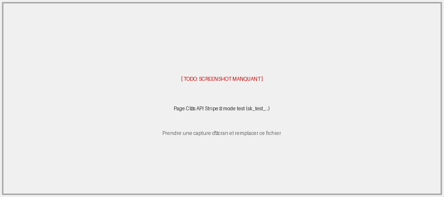

Une fois connecté, vous accédez au tableau de bord Stripe :

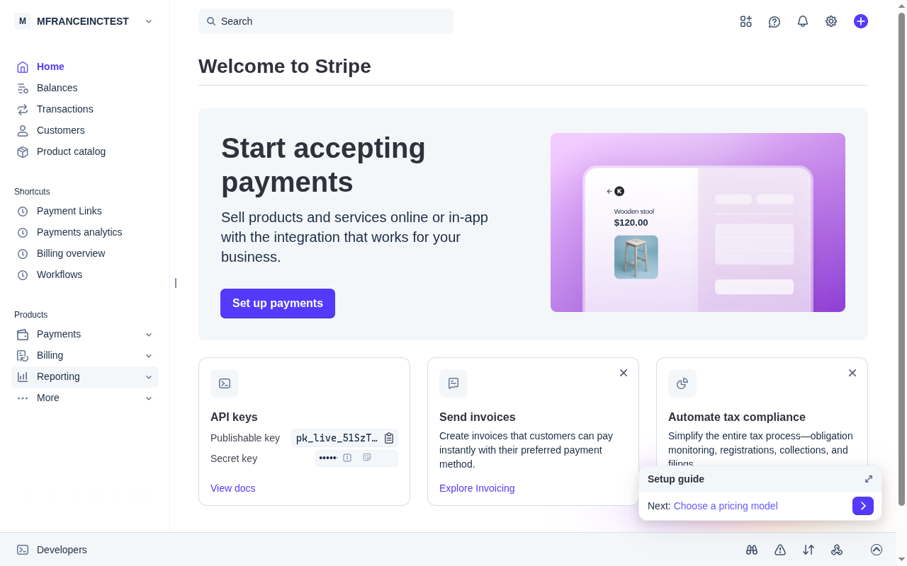

**3.1** Dans le menu de gauche, cliquez sur **Developers** (tout en bas).

**3.2** Cliquez sur **API keys**. La page suivante s'affiche :

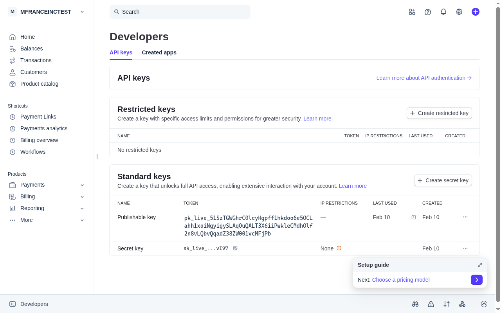

**3.3** Dans la section **Standard keys**, repérez la ligne **Secret key** (`sk_live_...`).

**3.4** Cliquez sur l'icône de copie à droite de la clé masquée, ou sur **···** pour accéder aux options :

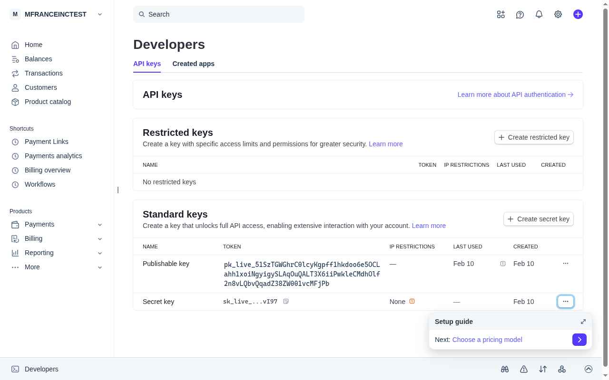

**3.5** Copiez et conservez la clé secrète — vous en aurez besoin à l'étape 5.

> **Important** : Ne partagez jamais votre clé secrète. Elle donne accès complet à votre compte Stripe.

---

## 4. Créer le webhook

Le webhook permet à Stripe de notifier Minipass automatiquement lors d'un paiement ou d'un virement bancaire. **Deux événements sont requis sur le même endpoint.**

### 4.1 Aller dans la section Webhooks

**4.1.1** Dans votre tableau de bord Stripe, cliquez sur **Developers** (en bas à gauche).

**4.1.2** Dans le panneau Workbench qui s'ouvre, cliquez sur l'onglet **Webhooks**.

**4.1.3** Cliquez sur **+ Add destination** :

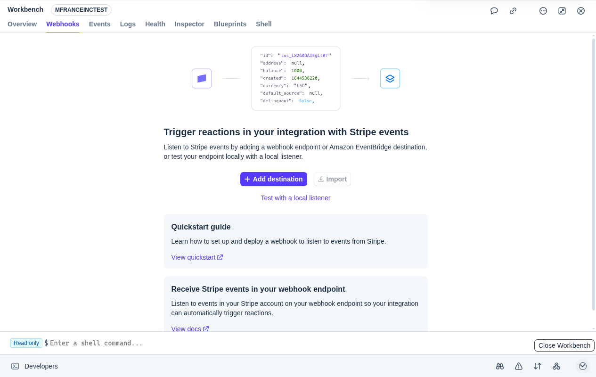

### 4.2 Sélectionner les deux événements

Un assistant en 3 étapes s'ouvre. La première étape vous demande de choisir les événements à écouter :

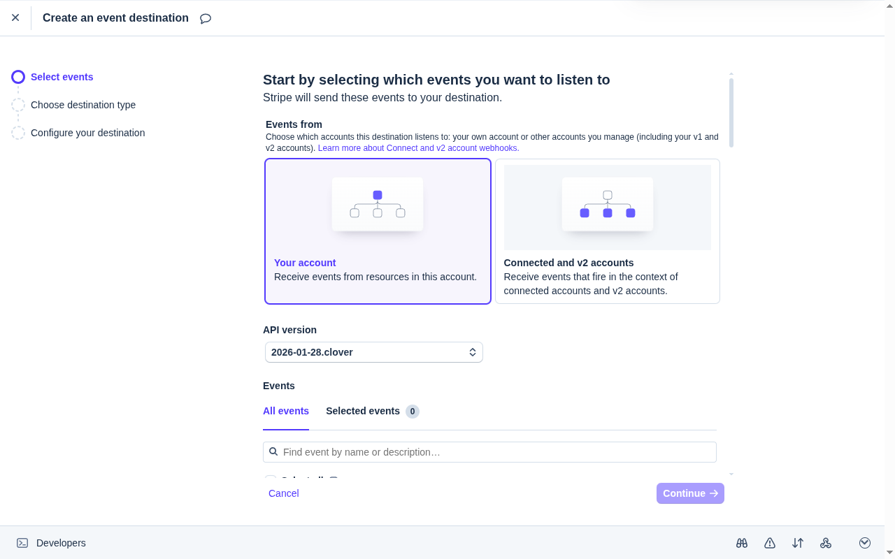

**4.2.1** Dans le champ **Find event by name or description…**, tapez `checkout.session.completed` et cochez-le.

**4.2.2** Effacez le champ, tapez `payout.paid` et cochez-le.

**4.2.3** Cliquez sur l'onglet **Selected events** pour confirmer que les **2 événements** sont bien sélectionnés :

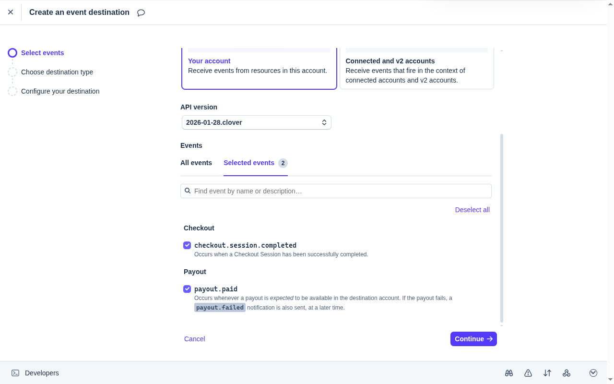

| Événement | Rôle |
|-----------|------|
| `checkout.session.completed` | Crée le passeport dès que le paiement est confirmé |
| `payout.paid` | Enregistre le virement bancaire dans les rapports financiers |

**4.2.4** Cliquez sur **Continue →**

### 4.3 Choisir le type de destination

**4.3.1** Sélectionnez **Webhook endpoint** (option déjà sélectionnée par défaut) :

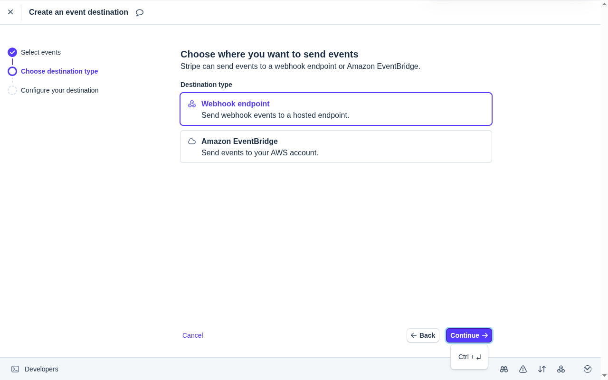

**4.3.2** Cliquez sur **Continue →**

### 4.4 Configurer l'URL de l'endpoint

**4.4.1** Dans le champ **Endpoint URL**, entrez l'URL de votre webhook Minipass :

```
https://VOTRE-SOUS-DOMAINE.minipass.me/stripe/webhook
```

Exemple pour le sous-domaine `lhgi` :
```
https://lhgi.minipass.me/stripe/webhook
```

> **Astuce** : Copiez cette URL directement depuis **Settings → Credit Card Settings (Stripe)** dans Minipass. Le champ **Webhook URL** la contient déjà prête à copier.

**4.4.2** Vérifiez que la ligne **Listening to** indique bien **2 events** :

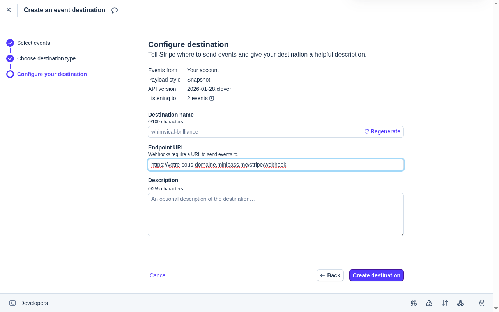

**4.4.3** Cliquez sur **Create destination**.

### 4.5 Copier le Webhook Signing Secret

Après la création, vous êtes redirigé vers la page de détails du webhook.

**4.5.1** Cherchez la section **Signing secret** et cliquez sur **Reveal**.

**4.5.2** Copiez le signing secret qui commence par `whsec_...` — vous en aurez besoin à l'étape 5.

---

## 5. Entrer les clés dans Minipass

**5.1** Connectez-vous à votre panneau d'administration Minipass.

**5.2** Dans le menu de gauche, cliquez sur **Settings → Email Settings**.

**5.3** Faites défiler jusqu'à la section **Credit Card Settings (Stripe)** et cliquez dessus pour l'ouvrir :

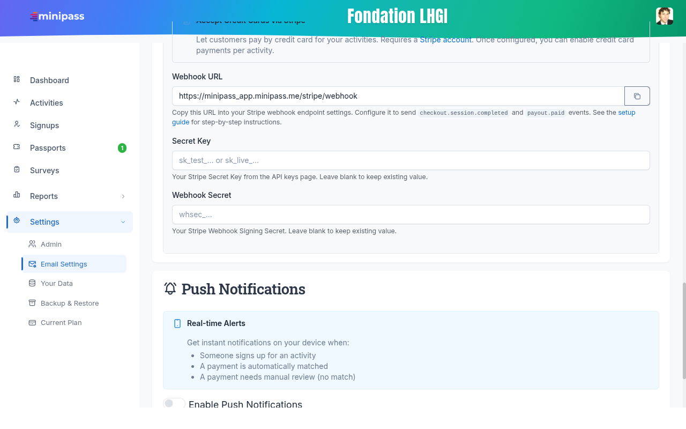

**5.4** Remplissez les deux champs :

| Champ | Valeur à coller |
|-------|-----------------|
| Secret Key | `sk_test_...` ou `sk_live_...` (de l'étape 3) |
| Webhook Secret | `whsec_...` (de l'étape 4.5) |

**5.5** Cliquez sur **Save Settings**.

---

## 6. Activer le paiement par carte sur une activité

**6.1** Allez dans **Activities** et sélectionnez l'activité à modifier (ou créez-en une nouvelle).

**6.2** Dans la section **Signup Settings**, activez le bouton **Accept credit card payments (Stripe)** :

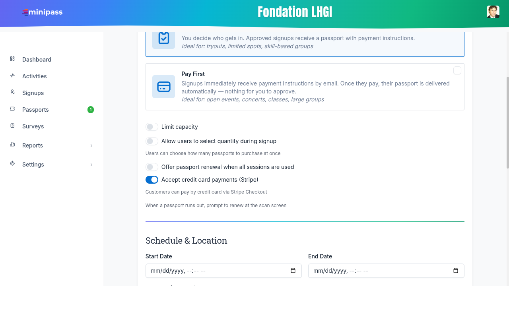

**6.3** Cliquez sur **Save**.

> **Note** : Cette option n'apparaît que si les clés Stripe sont configurées dans les paramètres. Si vous ne la voyez pas, vérifiez que l'étape 5 est complétée et que vous avez cliqué sur **Save Settings**.

---

## 7. Résultat : ce que vos clients verront

Lorsqu'un client s'inscrit à une activité avec le paiement par carte activé, il voit un choix entre deux méthodes de paiement :

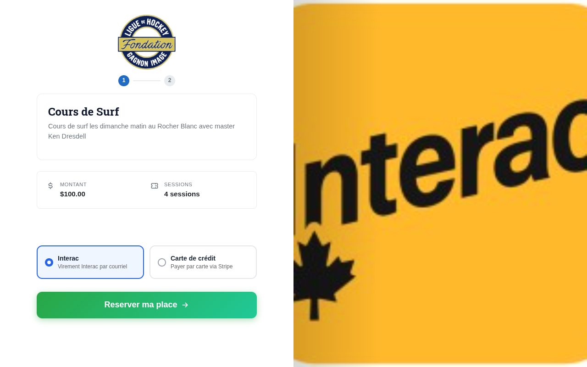

- **Interac** : Le client reçoit les instructions de virement par courriel
- **Carte de crédit** : Le client est redirigé vers une page de paiement sécurisée Stripe

Après un paiement par carte réussi, le passeport est créé **automatiquement** — aucune action manuelle n'est requise de votre part.

---

## 8. Vérification et test

### 8.1 Tester avec le mode test de Stripe

Avant de passer en mode live, nous recommandons de tester l'intégration de bout en bout :

**8.1.1** Assurez-vous d'utiliser les clés de **test** dans Minipass (`sk_test_...` et le webhook secret du mode test).

**8.1.2** Créez une activité de test avec la carte de crédit activée.

**8.1.3** Inscrivez-vous à l'activité comme un client, sélectionnez **Carte de crédit**.

**8.1.4** Sur la page de paiement Stripe, utilisez cette carte de test :

| Champ | Valeur |
|-------|--------|
| Numéro de carte | `4242 4242 4242 4242` |
| Date d'expiration | N'importe quelle date future (ex : `12/30`) |
| CVC | N'importe quel code à 3 chiffres (ex : `123`) |

**8.1.5** Vérifiez que le passeport a été créé automatiquement dans Minipass.

### 8.2 Passer en mode live

Une fois les tests réussis :

**8.2.1** Dans Stripe, désactivez le **Test mode** (bouton en haut à droite du tableau de bord).

**8.2.2** Allez dans **Developers → API keys** et copiez votre clé **live** (`sk_live_...`).

**8.2.3** Allez dans **Developers → Webhooks**. Vous remarquerez que le webhook créé en mode test **n'apparaît pas** — c'est normal : les webhooks de test et les webhooks live sont complètement séparés dans Stripe. Cliquez sur **+ Add destination** et créez un nouveau webhook en mode live avec la même URL (`https://VOTRE-SOUS-DOMAINE.minipass.me/stripe/webhook`) et les mêmes deux événements (`checkout.session.completed` et `payout.paid`). Ce nouveau webhook générera un nouveau signing secret `whsec_...`, différent de celui du mode test.

**8.2.4** Copiez le nouveau **Webhook signing secret** (`whsec_...`) du webhook live.

**8.2.5** Dans Minipass **Settings → Credit Card Settings (Stripe)**, remplacez les clés de test par les clés live et cliquez sur **Save Settings**.

---

## 9. FAQ / Dépannage

**9.1 — Je ne vois pas l'option "Accept credit card payments" dans mon activité**

Vérifiez que vous avez entré les clés Stripe dans **Settings → Credit Card Settings (Stripe)** et que vous avez cliqué sur **Save Settings**.

---

**9.2 — Le paiement par carte fonctionne en test mais pas en live**

- Assurez-vous d'avoir remplacé les clés de test par les clés live
- Vérifiez que votre compte Stripe est entièrement vérifié (l'activation peut prendre 1-2 jours)
- Assurez-vous que le webhook live est configuré avec la bonne URL et les deux événements

---

**9.3 — Le passeport n'est pas créé après le paiement**

- Vérifiez que le webhook est correctement configuré dans Stripe
- Vérifiez que l'URL est exacte : `https://VOTRE-SOUS-DOMAINE.minipass.me/stripe/webhook`
- Vérifiez que les deux événements (`checkout.session.completed` et `payout.paid`) sont sélectionnés
- Consultez **Developers → Webhooks** dans Stripe pour voir s'il y a des erreurs de livraison

---

**9.4 — Pourquoi dois-je ajouter deux événements webhook?**

`checkout.session.completed` crée le passeport immédiatement après le paiement.

`payout.paid` met à jour les rapports financiers lorsque Stripe vire l'argent sur votre compte bancaire (environ 7 jours plus tard). Sans ce deuxième événement, vos revenus Stripe apparaîtront toujours comme « en attente » dans vos rapports.

---

**9.5 — Quels sont les frais Stripe?**

Stripe facture des frais par transaction. Au Canada, les frais standards sont :
- **2.9% + 0.30$ CAD** par transaction réussie par carte de crédit
- Aucuns frais mensuels ou frais de configuration

Consultez [https://stripe.com/ca/pricing](https://stripe.com/ca/pricing) pour les tarifs actuels.

---

**9.6 — Puis-je utiliser Stripe et Interac en même temps?**

Oui ! Lorsque la carte de crédit est activée pour une activité, vos clients auront le choix entre les deux méthodes de paiement lors de l'inscription.

---

**9.7 — Comment voir mes paiements Stripe?**

Les paiements par carte de crédit apparaissent dans :
- **Votre tableau de bord Stripe** : [https://dashboard.stripe.com/payments](https://dashboard.stripe.com/payments)
- **Minipass** : Les paiements sont automatiquement enregistrés et visibles dans vos rapports financiers

---

*Pour toute question ou difficulté, contactez le support Minipass à l'adresse **support@minipass.me**.*
