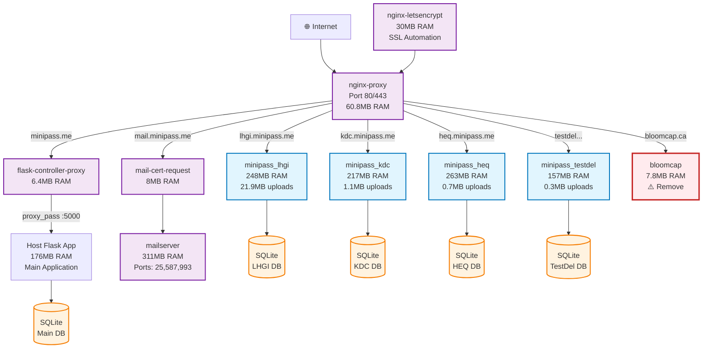
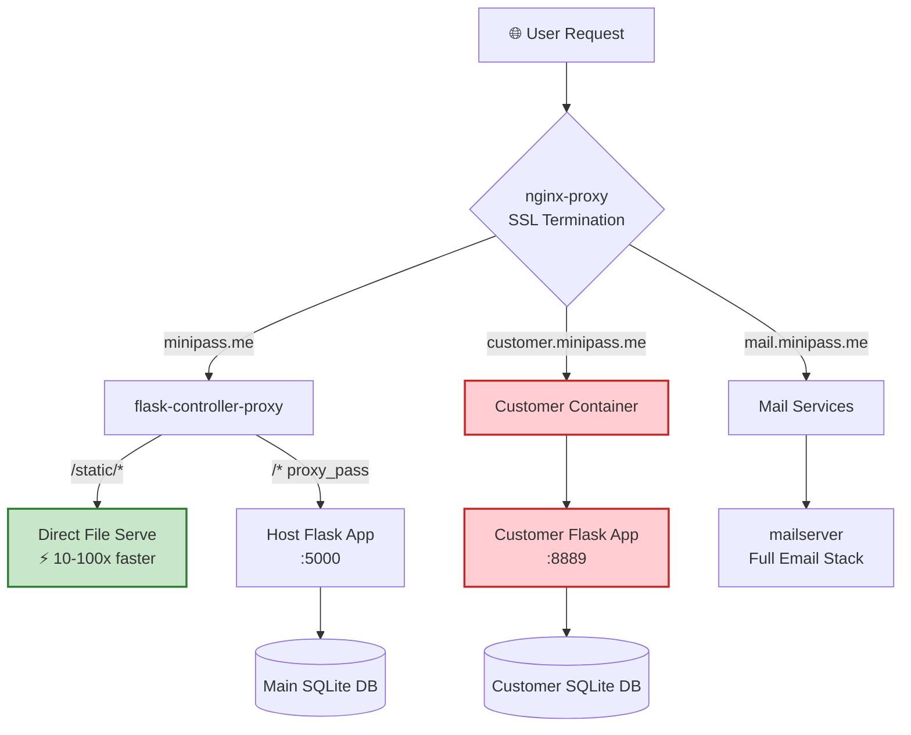
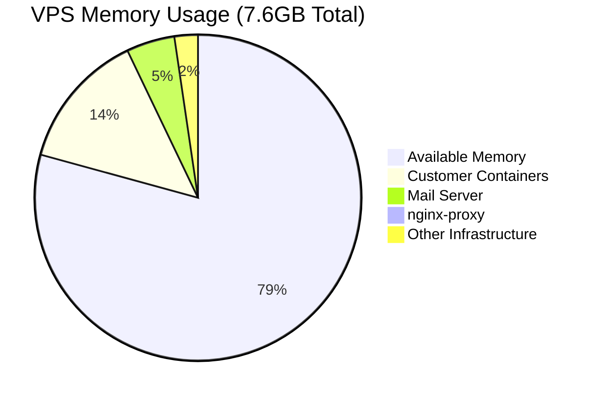
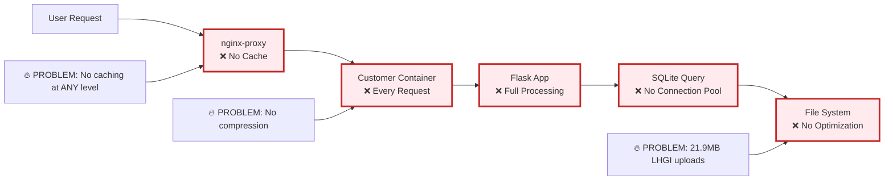
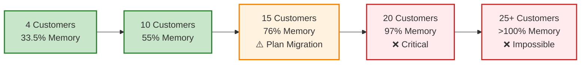
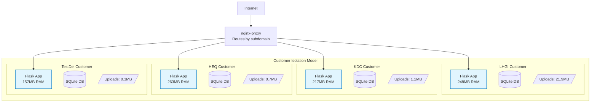
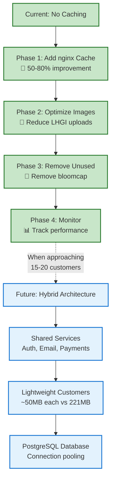
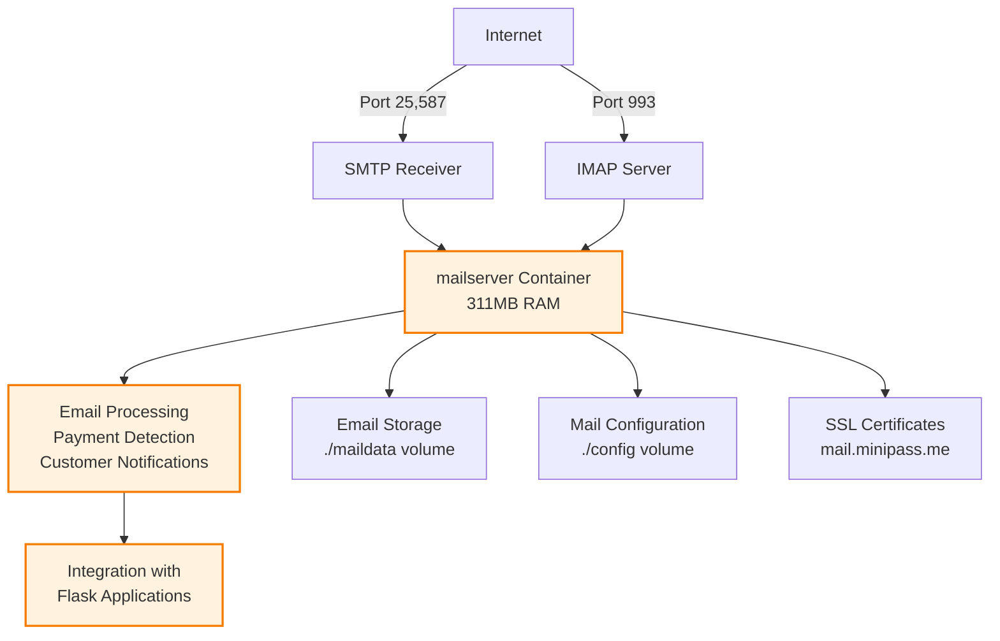
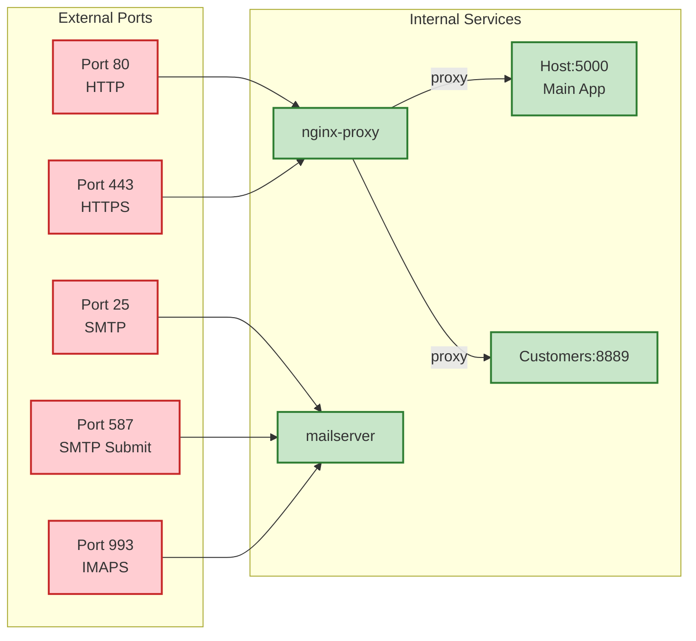

# Minipass VPS Architecture - Mermaid Diagrams

## Complete System Architecture

## Network Flow Architecture

## Resource Usage Breakdown

## Performance Bottleneck Analysis

## Scaling Projection

## Container-per-Customer Current Model

## Recommended Optimization Flow

## Email Infrastructure Detail

## Port Mapping Overview

